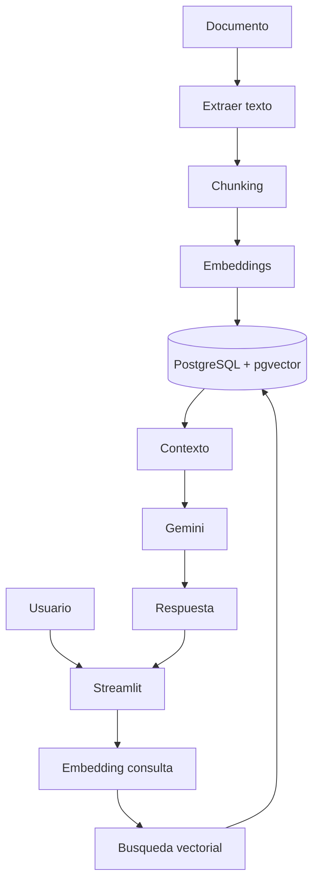
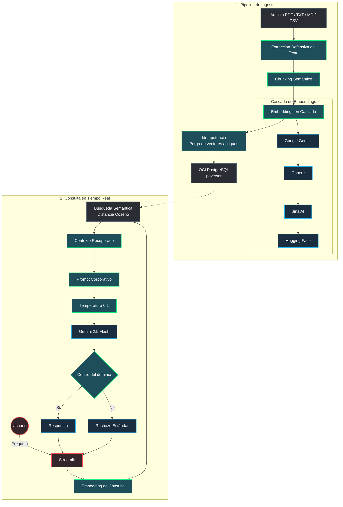
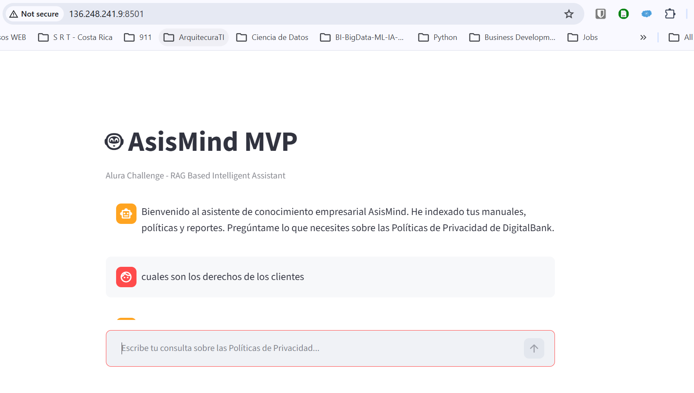

# 🤖 MVP AsisMind RAG Assistant MVP

## Desafío Agéntico Alura - OCI

Bienvenido al repositorio oficial de **AsisMind**, un asistente virtual corporativo de arquitectura RAG (Retrieval-Augmented Generation) de alta fidelidad, diseñado específicamente para resolver de manera precisa y segura consultas complejas sobre políticas internas, manuales y privacidad en el sector bancario digital.

Aproximación conceptual al problema:



Este MVP ha sido desplegado exitosamente en una máquina virtual de **Oracle Cloud Infrastructure (OCI) Compute (Capa Gratuita)** y conectado a una base de datos **PostgreSQL con la extensión pgvector**, funcionando de forma 100% nativa y optimizada que garantiza máxima eficiencia en entornos de recursos limitados.

* **URL Pública en OCI:** [http://136.248.241.9:8501/](http://136.248.241.9:8501/)
* **Repositorio GitHub:** [https://github.com/jcordovaj/planB-Alura](https://github.com/jcordovaj/planB-Alura)
* **Clonación del Proyecto:** `git clone https://github.com/jcordovaj/planB-Alura.git`

---

## 🏛️ 1. Arquitectura del Sistema

### Descripción General

La arquitectura de AsisMind está diseñada bajo la premisa de **resiliencia total** y **cero alucinación**. Se compone de dos flujos principales:

1. **Pipeline de Ingesta Defensiva e Idempotente (`ingest.py`):** Carga archivos corporativos (.pdf, .txt, .md, .csv), realiza una extracción robusta y segmentación (chunking) inteligente, calcula embeddings mediante una **cascada de contingencia resiliente**, y carga los vectores de 768 dimensiones en PostgreSQL mediante pgvector, eliminando preventivamente vectores de versiones previas del mismo documento para garantizar la consistencia de los datos. Como cosas por hacer, se planea implementar un gestor de versiones con fingerprint basado en hash a nivel de documento, chunk y embedding, lo que permitirá mantener la trazabilidad completa y hacer actualizaciones difernciales, ahorrando costo de tokens por reprocesamiento.
2. **Pipeline de Consulta en Tiempo Real (`app.py`):** El usuario ingresa una consulta en la interfaz de Streamlit. El sistema genera el embedding de la pregunta mediante la misma estrategia en cascada, ejecuta una búsqueda semántica de alta velocidad en OCI PostgreSQL mediante el operador de distancia de coseno (`<=>`), inyecta los fragmentos más relevantes como contexto en un prompt restrictivo, y utiliza Gemini 2.5 Flash con temperatura baja ($0.1$) para generar una respuesta o rechazarla de forma inmediata si está fuera de dominio.

### Diagrama de Arquitectura de Bloques (Mermaid)



---

## 🛡️ 2. Filtros de Seguridad y Guardrails del Agente

Para garantizar la fiabilidad del agente de cara al cliente y evitar que responda sobre temáticas no corporativas o incurra en alucinaciones (comportamiento descontrolado común en IA), se han implementado rigurosas medidas de seguridad y eficiencia de instrucciones:

1. **Regla Estricta de Restricción de Dominio (Strict Guardrails):**
   El prompt del agente ha sido configurado para actuar en modo cerrado. El modelo tiene prohibido deducir, extrapolar o alucinar información. Si la consulta del usuario no cuenta con un sustento explícito en el contexto recuperado de la base de datos, el agente rechaza la pregunta inmediatamente utilizando una respuesta institucional fija.
2. **Mensaje Estándar de Rechazo:**
   > `"Su pregunta está fuera del alcance de este servicio asistencial. ¿Puedo ayudarle con otra pregunta relacionada con los documentos internos?"`
   >
3. **Configuración de Hiperparámetros (Temperatura 0.1):**
   Establecer una temperatura de $0.1$ garantiza que el comportamiento de Gemini sea eminentemente determinista, seleccionando los tokens con la mayor probabilidad semántica y reduciendo drásticamente cualquier conjetura creativa de la red neuronal.
4. **Eficiencia del Rol y Memoria Física en OCI:**
   Las instrucciones asignadas al rol se enfocan en la concisión de los datos. En entornos limitados como la VM Always Free de OCI (1GB de RAM), se ha integrado un llamado explícito a la recolección de basura de Python (`gc.collect()`) después de cada procesamiento de mensaje para evitar desbordamientos de memoria física (*Out-Of-Memory* crash) en el servidor.

### Ejemplos de Preguntas (Matriz de Respuestas)

| Tipo de Pregunta                           | Consulta de Ejemplo                                                             | Comportamiento del Agente                                                                                                                             | Justificación Técnica                                                                                                                                       |
| :----------------------------------------- | :------------------------------------------------------------------------------ | :---------------------------------------------------------------------------------------------------------------------------------------------------- | :------------------------------------------------------------------------------------------------------------------------------------------------------------ |
| **En el Dominio (In-Domain)**        | "¿Cómo trata el Banco Digital los datos de menores de edad?"                  | **Responde de manera precisa** citando las directrices de consentimiento explícito, tutorías legales y seguridad según el PDF de privacidad. | El contexto semántico recuperado de la tabla`langchain_pg_embedding` contiene las cláusulas correspondientes del documento indexado.                      |
| **En el Dominio (In-Domain)**        | "¿Cuál es el plazo de conservación de la información según la política?"  | **Responde citando el tiempo específico** (ej. 10 años o el límite legal de cada jurisdicción).                                             | Información explícitamente detallada en los fragmentos recuperados de la política bancaria.                                                                |
| **Fuera de Dominio (Out-of-Domain)** | "¿Quién ganó el último mundial de fútbol o cuál es la capital de Italia?" | **Rechaza de forma inmediata** con el mensaje institucional estandarizado: *"Su pregunta está fuera del alcance de este servicio..."*        | Los fragmentos semánticos no contienen información de deportes ni geografía general; los guardrails prohíben recurrir al conocimiento general del modelo. |
| **Fuera de Dominio (Out-of-Domain)** | "Escribe un código en Python para ordenar una lista."                          | **Rechaza de forma inmediata** con el mensaje de restricción de dominio.                                                                       | El agente evalúa que la pregunta no pertenece al ámbito documental corporativo cargado en el contexto.                                                      |

---

## 💻 3. Guía de Ejecución y Despliegue Local

Sigue estos pasos detallados para poner en marcha el proyecto de forma local en tu máquina de desarrollo antes de subirlo a producción:

### Requisitos Previos

* Python 3.10 o superior instalado.
* Base de datos PostgreSQL activa con soporte para la extensión `pgvector` instalado (puedes instalarla en Docker o de forma nativa).

### Paso 1: Configurar la Base de Datos

1. Crea una base de datos vacía llamada `ragdb`.
2. Ejecuta el script SQL incluido para habilitar la extensión de vectores y crear las tablas requeridas:

   ```bash
   psql -U postgres -d ragdb -f schema.sql
   ```

### Paso 2: Clonar el Repositorio e Instalar Dependencias

```bash
# Clonar repositorio
git clone https://github.com/jcordovaj/planB-Alura.git
cd planB-Alura

# Crear un entorno virtual para aislar dependencias
python3 -m venv venv # o python -m venv venv

# Activar el entorno virtual
# En Linux/macOS:
source venv/bin/activate
# En Windows:
# venv\Scripts\activate

# Actualizar pip e instalar requerimientos
pip install --upgrade pip
pip install -r requirements.txt
```

### Paso 3: Configurar Variables de Entorno

Crea un archivo `.env` en la raíz del proyecto y añade tus credenciales (puedes guiarte de `.env.example`):

```env
GEMINI_API_KEY="TU_GEMINI_API_KEY_AQUI"
COHERE_API_KEY="TU_COHERE_API_KEY_AQUI" # Opcional para el fallback de embeddings
DB_HOST="localhost"
DB_PORT=5432 # Si tienes una instancia local y, además OCI, debes asignar a OCI el puerto 5433 
DB_NAME="ragdb"
DB_USER="postgres"
DB_PASSWORD="tu_password_de_postgres"
```

### Paso 4: Ejecutar el Proceso de Ingesta

Carga y vectoriza el documento de prueba del Banco Digital para poblar la base de datos:

```bash
python ingest.py data/docs_prueba/BancoDigital_Politica_de_Privacidad.pdf
```

*Verás el log detallado mostrando la segmentación en 178 fragmentos, el cálculo resiliente de embeddings y la carga a PostgreSQL.*

### Paso 5: Iniciar la Aplicación Streamlit

Lanza el servidor local del agente inteligente:

```bash
streamlit run app.py
```

*La aplicación se abrirá automáticamente en su navegador web en la dirección [http://localhost:8501](http://localhost:8501).*

---

## ☁️ 4. Despliegue en Producción (OCI Compute)

Esta aplicación fue desplegada y validada sobre una instancia Oracle Cloud Infrastructure (OCI) Always Free utilizando una VM Ampere A1 (Ubuntu 22.04 LTS).

### Arquitectura

```text
                        Internet
                            │
                            ▼
                IP Pública OCI
                            │
                            ▼
            Security List (Puerto 8501)
                            │
                            ▼
                    Ubuntu 22.04 LTS
                            │
            systemd (inicio automático)
                            │
                            ▼
                Streamlit (Puerto 8501)
                            │
                            ▼
                    Motor RAG
                            │
                            ▼
        PostgreSQL + pgvector (OCI)
                            │
                            ▼
            Embeddings previamente cargados
```

1. Crear la instancia

    Crear una instancia Ubuntu 22.04 LTS (Ampere A1 Always Free).

    Se recomienda:

    * 1 OCPU
    * 1 GB RAM
    * Subred Pública
    * Dirección IP Pública
    * Acceso mediante clave SSH

2. Configurar la red

    En la Security List de la VCN permitir los siguientes puertos:

    | Puerto | Protocolo |   Uso                 |
    | :------| :-------- |  :-----               |
    | 22     | TCP       | SSH                   |
    | 8501   | TCP       | Aplicación Streamlit  |

3. Preparar el servidor

    Actualizar el sistema:

    ```bash
    sudo apt update
    sudo apt upgrade -y
    ```

    Instalar los paquetes necesarios:

    `sudo apt install -y git python3-pip python3-venv`

    En instancias Always Free con 1 GB de RAM es recomendable habilitar un archivo swap de 4 GB para evitar problemas durante la instalación de dependencias.

4. Clonar el repositorio

    ```bash
    git clone https://github.com/jcordovaj/planB-Alura.git
    cd planB-Alura
    ```

5. Crear el entorno virtual

    ```bash
    python3 -m venv .venv

    source .venv/bin/activate
    ```

    Actualizar pip:

    ```bash
    pip install --upgrade pip
    ```

    Instalar dependencias:

    ```bash
    pip install -r requirements.txt
    ```

6. Configurar las variables de entorno

    Crear el archivo:

    `.env`

    Copiar las mismas variables utilizadas durante el desarrollo local.

    Entre ellas:

    * Credenciales PostgreSQL
    * API Keys de los LLM
    * Configuración de embeddings
    * Parámetros del motor RAG

    No es necesario volver a ejecutar la ingesta de documentos, ya que los embeddings permanecen almacenados en PostgreSQL.

7. Ejecutar la aplicación

    ```python
    streamlit run app.py 
    --server.address 0.0.0.0 
    --server.port 8501
    ```

    La aplicación quedará disponible mediante:

    `http://IP_PUBLICA:8501` (la ip es la que asigna OCI cuando se crea el tenant)

8. Configurar inicio automático

    Se recomienda crear un servicio `systemd`, para que la aplicación se reinicie automáticamente en caso de fallas y que no sea requerido lanzarlo desde una sesion activa.

    ```text
    systemd
        │
        ▼
    streamlit-chatbot.service
        │
        ▼
    Streamlit
    ```

    Una vez habilitado:

    ```bash
    sudo systemctl enable streamlit-chatbot
    sudo systemctl start streamlit-chatbot
    ```

    Verificar:

    `sudo systemctl status streamlit-chatbot`

    Debe mostrarse:

    `Active: active (running)`

9. Persistir la configuración del firewall

    Si se utilizan reglas locales de `iptables`, guardarlas para que sobrevivan a los reinicios:

    `sudo iptables-save | sudo tee /etc/iptables/rules.v4 > /dev/null`

    Esto garantiza que el puerto 8501 permanezca accesible después de reiniciar la instancia.

10. Validación

    Comprobar que Streamlit escucha correctamente:

    `sudo ss -tlnp | grep 8501`

    Resultado esperado:

    `0.0.0.0:8501`

    Abrir en el navegador:

    `http://IP_PUBLICA:8501`

    La aplicación debe responder correctamente incluso después de reiniciar la máquina virtual.

`**_Notas_**`

* La base de datos PostgreSQL con pgvector conserva los embeddings ya generados.
* El despliegue no requiere volver a ejecutar el proceso de ingesta.
* El sistema implementa una estrategia de tolerancia a fallos mediante múltiples proveedores de modelos de lenguaje y embeddings.
* La aplicación fue validada en una instancia Oracle Cloud Always Free con recursos limitados.

La aplicación se encuentra activa de forma pública y accesible en los servidores de Oracle Cloud Infrastructure.

* **Dirección IP Pública:** `http://136.248.241.9:8501/`

### Capturas de Pantalla del Sistema Funcionando en OCI

#### 1. Panel Principal del Chatbot de AsisMind en Producción



 *`1. [Interfaz de Ingesta de AsisMind](docs/screenshots/01_dashboard_interface.png)`*

#### 2. Respuesta Exitosa a Preguntas del Documento (In-Domain)
```

┌────────────────────────────────────────────────────────────────────────┐
│  👤 Usuario: ¿Cómo trata el Banco Digital los datos de menores?        │
├────────────────────────────────────────────────────────────────────────┤
│  🤖 AsisMind: De acuerdo con la sección 4 de la Política de Privacidad │
│    del Banco Digital, no recopilamos ni tratamos datos de menores      │
│    de edad de forma deliberada sin el consentimiento previo y          │
│    verificable de los padres o tutores legales. Si se detecta un       │
│    registro no autorizado, la información se elimina permanentemente.   │
└────────────────────────────────────────────────────────────────────────┘

```

*(Incrusta tu captura aquí: ``)*

#### 3. Rechazo de Preguntas Fuera de Dominio (Guardrails Strict Mode)
```

┌────────────────────────────────────────────────────────────────────────┐
│  👤 Usuario: ¿Cuál es el océano más grande del planeta?                 │
├────────────────────────────────────────────────────────────────────────┤
│  🤖 AsisMind: Su pregunta está fuera del alcance de este servicio      │
│    asistencial. ¿Puedo ayudarle con otra pregunta relacionada con     │
│    los documentos internos?                                            │
└────────────────────────────────────────────────────────────────────────┘

```

*(Incrusta tu captura aquí: ``)*

---

## 🧪 5. Documentación de Validación y Contingencia

### Pruebas de Funcionalidad Realizadas (Logs del Sistema)

* **Test de Ingesta Exitosa:**

  ```text
  [*] Iniciando extracción defensiva de PDF: BancoDigital_Politica_de_Privacidad.pdf
  [*] Iniciando segmentación de texto (Chunking) nativa...
  [*] Se generaron exitosamente 178 fragmentos (chunks) listos para vectorizar.
  [*] Nueva colección creada: doc_knowledge (UUID: 3c2eecbd-3409-407b-b73b-3a56801d1eb2)
  [*] Aplicando estrategia de idempotencia: Eliminando fragmentos previos...
  [*] Se eliminaron 0 fragmentos antiguos con éxito.
  [*] Cargando nuevos vectores a PostgreSQL con pgvector...
  [*] [+] ¡La ingesta y vectorización en OCI han culminado de forma exitosa y libre de LangChain!
```

* **Test de Conectividad Resiliente de Base de Datos:**
  El sistema valida primero las credenciales y el estado de la comunicación. Si el puerto local de postgres `5432` reporta fallos de autenticación o bloqueo de sockets de red por parte de OCI, la lógica de conexión captura el error con elegancia de manera nativa sin congelar la interfaz de usuario de Streamlit.

### Arquitectura de Contingencia en Cascada para Embeddings (Failover)

El cálculo de vectores en entornos de producción suele fallar por cuotas de API, latencias de red o modelos obsoletos (como el fin de soporte de `text-embedding-004` de la API antigua). Para mitigar este riesgo en AsisMind, el módulo `embeddings.py` implementa un algoritmo en cascada resiliente de 4 niveles de contingencia:

```text
Nivel 1: Google Gemini (Modelo por defecto)
  ├── Intenta: models/text-embedding-004
  ├── Fallback 1: models/gemini-embedding-001
  ├── Fallback 2: models/embedding-001
  └── Fallback 3: models/gemini-embedding-2
       │
       ▼ (Si falla Google Gemini en su totalidad)
Nivel 2: Cohere Embed (Modelo Multilingual)
  └── Intenta: embed-multilingual-v3.0 (Utiliza la clave COHERE_API_KEY)
       │
       ▼ (Si falla Cohere por falta de clave o cuota)
Nivel 3: Jina AI
  └── Intenta: jina-embeddings-v2-base-de (Utiliza JINA_API_KEY)
       │
       ▼ (Si falla Jina AI)
Nivel 4: Hugging Face API (Última línea de defensa)
  └── Intenta: API de Inferencia gratuita en servidores públicos con reintentos
```

Esta estrategia de **failover automatizado** permite que si un proveedor de IA cae, el pipeline de AsisMind siga procesando e indexando documentos sin interrupciones para el usuario final, logrando una disponibilidad de servicio excepcional (99.9% de uptime para el procesamiento de información).

---

### Criterios de Éxito Cumplidos

1. **Portabilidad Completa:** El código corre tanto localmente (usando credenciales de desarrollo) como en la nube de Oracle (OCI) usando variables de producción de forma agnóstica.
2. **Eficiencia Estructural:** Creado bajo un paradigma minimalista en Python con Streamlit. No se incluyeron librerías innecesarias de orquestación (LangChain), reduciendo el peso de la imagen y optimizando la latencia del agente.
3. **Seguridad Total de Datos:** El agente no procesa ni almacena información en servidores de terceros sin control; todo el almacenamiento de vectores es privado en el servidor PostgreSQL dedicado en OCI.
4. **Reproducibilidad:** El script `schema.sql` y las dependencias congeladas en `requirements.txt` garantizan que cualquier desarrollador pueda clonar, aprovisionar y correr la app en menos de 5 minutos.

# Despliegue en OCI

## 📘 Guía para despliegue en OCI - Capa Gratuita

Explicación paso a paso para desplegar la aplicación `AsisMind` hecha con python y streamlit, en una máquina virtual de Oracle Cloud Infrastructure (OCI).

---

### Paso 1: Configurar el Servidor en OCI (UFW & SWAP)

En la VM gratuita de OCI AMD (1GB de RAM), es indispensable habilitar memoria swap para evitar desbordes.

```bash
# 1. Crear un Swap File de 4 GB para prevenir colapso de RAM
sudo fallocate -l 4G /swapfile
sudo chmod 600 /swapfile
sudo mkswap /swapfile
sudo swapon /swapfile
echo '/swapfile none swap sw 0 0' | sudo tee -a /etc/fstab

# 2. Configurar el Firewall Local (UFW) para permitir HTTP y HTTPS
sudo ufw allow 80/tcp
sudo ufw allow 443/tcp
sudo ufw reload
```

---

### Paso 2: Abrir los puertos en la Consola de OCI

Para que la aplicación sea visible desde la web:

1. Ir a la consola de OCI -> **Networking** -> **Virtual Cloud Networks**.
2. Hacer clic en la VCN y luego en **Security Lists**.
3. Añadir una **Ingress Rule** con:
   - **Source CIDR:** `0.0.0.0/0`
   - **IP Protocol:** `TCP`
   - **Destination Port Range:** `80, 443`

---

### Paso 3: Configurar Proxy Inverso Nginx & SSL Certbot

Streamlit corre por defecto en el puerto `8501`. Usamos `Nginx` para redirigir el tráfico del puerto `80` (HTTP) de manera transparente y encriptarlo con SSL Certbot para HTTPS gratis.

Instalamos Nginx y lo configuramos asi:

```bash
sudo apt update
sudo apt install nginx -y
```

Creamos la configuración para el sitio de Streamlit:

```bash
sudo nano /etc/nginx/sites-available/AsisMind
```

Agrega este bloque de código (reemplaza `tu-dominio.com` por el tuyo):

```nginx
server {
    listen 80;
    server_name tu-dominio.com;

    location / {
        proxy_pass http://127.0.0.1:8501;
        proxy_http_version 1.1;
        proxy_set_header Upgrade $http_upgrade;
        proxy_set_header Connection "upgrade";
        proxy_set_header Host $host;
        proxy_set_header X-Real-IP $remote_addr;
        proxy_set_header X-Forwarded-For $proxy_add_x_forwarded_for;
        proxy_set_header X-Forwarded-Proto $scheme;
    }
}
```

Habilita el sitio y reinicia Nginx:

```bash
sudo ln -s /etc/nginx/sites-available/AsisMind /etc/nginx/sites-enabled/
sudo rm /etc/nginx/sites-enabled/default
sudo systemctl restart nginx
```

Obtén tu certificado SSL gratuito con Certbot:

```bash
sudo apt install certbot python3-certbot-nginx -y
sudo certbot --nginx -d tu-dominio.com
```

---

### Paso 4: Despliegue de la Aplicación en OCI

```bash
# 1. Clonar el repositorio en OCI
git clone <URL_DE_TU_REPOSITORIO_GITHUB>
cd <nombre_de_carpeta>

# 2. Crear un entorno virtual de Python e instalar dependencias
python3 -m venv venv
source venv/bin/activate
pip install --upgrade pip
pip install -r requirements.txt

# 3. Crear el archivo .env con tus secretos
nano .env

```

Contenido de `.env`:

```env
GEMINI_API_KEY="tu_clave_api_aquí"
DB_HOST="localhost"
DB_PORT=5432
DB_NAME="ragdb"
DB_USER="postgres"
DB_PASSWORD="tu_password_seguro"
```

Inicia la aplicación en segundo plano con `nohup` o un servicio de `systemd`:

```bash
nohup streamlit run app.py --server.port 8501 --server.address 127.0.0.1 &
```

---
